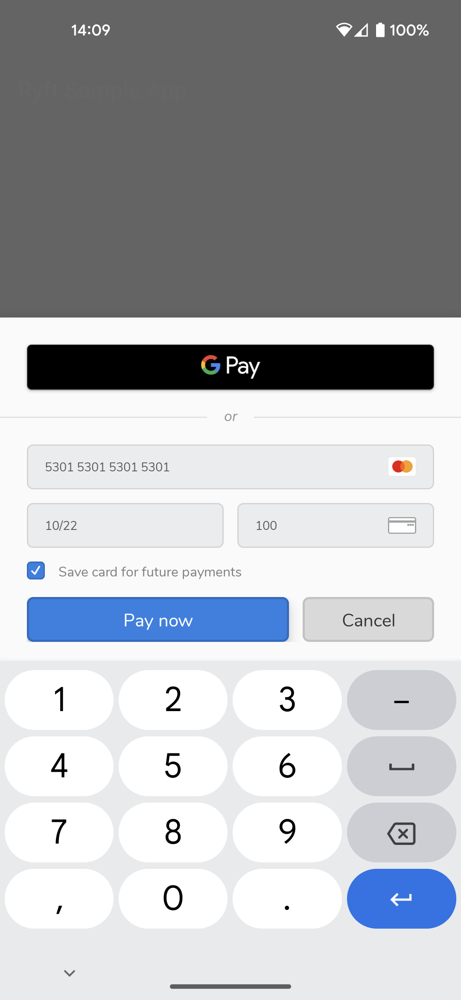

# Ryft Android

[](https://github.com/RyftPay/ryft-android/actions/workflows/build-and-test.yml) [](https://jitpack.io/#RyftPay/ryft-android) [](LICENSE)

Ryft for Android allows you to accept in-app payments securely and safely using our customisable UI elements.

 

## Requirements

- Android `minSdkVersion` 21 or above
- Android `compileSdkVersion` 28 or above (required for [Google Pay™](https://developer.ryftpay.com/google-pay))

### Google Pay

In order to accept Google Pay payments in production, you must complete all the steps in the Android Google Pay for Payments documentation for [deploying your application](https://developers.google.com/pay/api/android/guides/test-and-deploy/deploy-your-application)

Note: the Google Pay environment is determined by your public API key.

## Installation

Ryft Android is available via jitpack

### Jitpack

Add the jitpack repository to your project's `build.gradle`:

```groovy
allprojects {
    repositories {
        // ...
        maven { url 'https://jitpack.io' }
        // ...
    }
}
```

Add the ryft-android dependency to your module's `build.gradle`:

```groovy
dependencies {
    // ...
    implementation 'com.github.RyftPay:ryft-android:1.2.0'
    // ...
}
```

## Usage

The drop-in component provides you with all the necessary functions in order to enter and pay with your customer's card details.

The drop-in will handle formatting and input error as your user's type.

For the following steps, ensure you've imported the relevant Ryft packages:

### Initialising the drop-in

You should store and initialise the drop-in within the activity or fragment which handles your checkout process.

This must be done within the `onCreate()` function

**Example:**

```kotlin
class CheckoutFragment : Fragment() {

    // ...
    // Declare RyftDropIn
    private lateinit var ryftDropIn: RyftDropIn
    // ...

    // Instantiate DefaultRyftDropIn in onCreate()
    override fun onCreate(savedInstanceState: Bundle?) {
        super.onCreate(savedInstanceState)
        // ...
        ryftDropIn = DefaultRyftDropIn(
            // The calling fragment (activity is also supported)
            fragment = this,
            // The class you want to listen for the result (see "Implementing the RyftDropInResultListener" below)
            listener = paymentResultListener,
            RyftPublicApiKey("<your public API key>")
        )
        // ...
    }
    
    // ...
}
```

Under the hood the drop-in will detect the appropriate environment based on your public API key.

### Showing the drop-in

In order to present the drop in to the user, you simply have to call the drop-in method `show()` whilst passing in your configuration

**Example:**

```kotlin
class CheckoutFragment : Fragment() {
    
    // ...
    // Example pay button
    private lateinit var payButton: Button
    // ...
    
    override fun onViewCreated(view: View, savedInstanceState: Bundle?) {
        super.onViewCreated(view, savedInstanceState)
        // ...
        payButton.setOnClickListener {
            showDropIn()
        }
        // ...
    }
    
    // ...
    
    // Example function to call the drop in
    private fun showDropIn() {
        ryftDropIn.show(
            // Example config for sub account payments
            RyftDropInConfiguration.subAccountPayment(
                clientSecret = "<the client secret of the payment-session>",
                subAccountId = "<the Id of the sub-account you are taking payments for>",
                googlePayConfiguration = RyftDropInGooglePayConfiguration(
                    merchantName = "<The name of your business>",
                    merchantCountryCode = "<The ISO 3166-1 alpha-2 country code of your business>"
                )
            )
            // Example config for standard account payments
            // RyftDropInConfiguration.standardAccountPayment(
            //     clientSecret = "<the client secret of the payment-session>",
            //     googlePayConfiguration = RyftDropInGooglePayConfiguration(
            //         merchantName = "<The name of your business>",
            //         merchantCountryCode = "<The ISO 3166-1 alpha-2 country code of your business>"
            //     )
            // )
        )
    }
    
    // ...
}
```

#### Google Pay

Google Pay will be available for users providing the following is true:
- You have provided a RyftDropInGooglePayConfiguration object when displaying the drop-in
- The user has Google Pay setup on their device

Note: if you don't provide a RyftDropInGooglePayConfiguration object then Google Pay is disabled

### Implementing the RyftDropInResultListener

Once the customer has submitted their payment, the drop-in will dismiss.

To handle the result, you have to specify a listener on construction that will implement the `RyftDropInResultListener` interface:

```kotlin
interface RyftDropInResultListener {
    fun onPaymentResult(result: RyftPaymentResult)
}
```

This method is invoked once the customer has entered their payment method details and submitted the payment

**Example:**

```kotlin
class CheckoutFragment : Fragment(), RyftDropInResultListener {

    // ...
    
    override fun onCreate(savedInstanceState: Bundle?) {
        super.onCreate(savedInstanceState)
        // ...
        ryftDropIn = DefaultRyftDropIn(
            fragment = this,
            listener = this, // This fragment will listen for the dropin result
            RyftPublicApiKey("<your public API key>")
        )
        // ...
    }
    
    // ...

    override fun onPaymentResult(result: RyftPaymentResult) =
        when (result) {
            // Payment approved - send the customer to your receipt/success page
            is RyftPaymentResult.Approved -> {
                navigateToOrderSuccessFragment()
            }
            // Payment failed - show an alert to the customer
            // `result.error.displayError` provides a human friendly message you can display
            is RyftPaymentResult.Failed -> {
                AlertDialog.Builder(requireContext())
                    .setTitle("Error taking payment")
                    .setMessage(result.error.displayError)
                    .setPositiveButton("Try again") { _, _ ->
                        showDropIn()
                    }
                    .setNegativeButton("Cancel") { dialog, _ ->
                        dialog.dismiss()
                    }
                    .create()
                    .show()
            }
            // Payment cancelled - you may want to log that the customer cancelled
            is RyftPaymentResult.Cancelled -> {
                // Log that the customer cancelled the payment
            }
        }
    
    // ...
}
```

Note that if a payment requires further action for the payment to be approved (e.g. 3ds), this is handled internally within the drop-in.

No action is required from you in this use-case and you will either be notified that the payment was then approved, or that it failed (e.g. due to 3ds authentication)

### Using the drop-in for setting up cards for future use

A common use-case for some businesses is setting up and storing cards without charging the customer.
This is also known as zero-value authorization or account verification.


The drop-in currently has 2 usages:
- `Payment` (your customer is actively checking out and completing a purchase)
- `SetupCard` (your customer wants to save their card for future use without incurring any charges)

By default we will use `Payment`, however to customise the view simply pass the `usage` within the `display` configuration when initialising the drop-in:

```kotlin
// Account verifications must be done via the standard account holder
RyftDropInConfiguration.standardAccountPayment(
    clientSecret = "<the client secret of the payment-session>",
    display = RyftDropInDisplayConfiguration(
        usage = RyftDropInUsage.SetupCard
    )
    // Google Pay will not be shown so there is no need to provide the config
)
```

### Customising the drop-in

You can customise the title of the pay button by providing `payButtonTitle` within the `display` configuration when initialising the drop-in:

```kotlin
// Example for sub account payments
RyftDropInConfiguration.subAccountPayment(
    clientSecret = "<the client secret of the payment-session>",
    subAccountId = "<the Id of the sub-account you are taking payments for>",
    display = RyftDropInDisplayConfiguration(
        payButtonTitle = "Pay now"
    )
)

// Example for standard account payments
RyftDropInConfiguration.standardAccountPayment(
    clientSecret = "<the client secret of the payment-session>",
    display = RyftDropInDisplayConfiguration(
        payButtonTitle = "Pay now"
    )
)
```

### Further documentation

For more information, please find our docs [here](https://developer.ryftpay.com/docs/build/android-mobile)

## Sample app

A sample application that demonstrates how to use this SDK can be found [here](https://github.com/RyftPay/ryft-android/tree/master/ryft-sample-app)